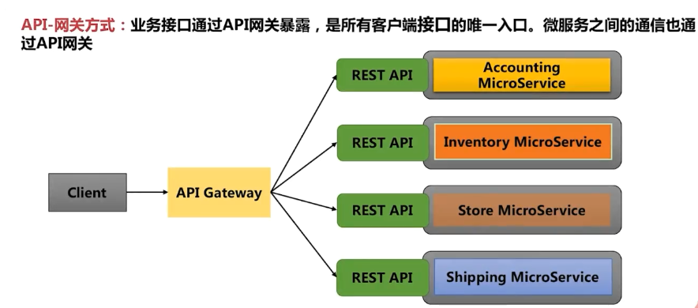
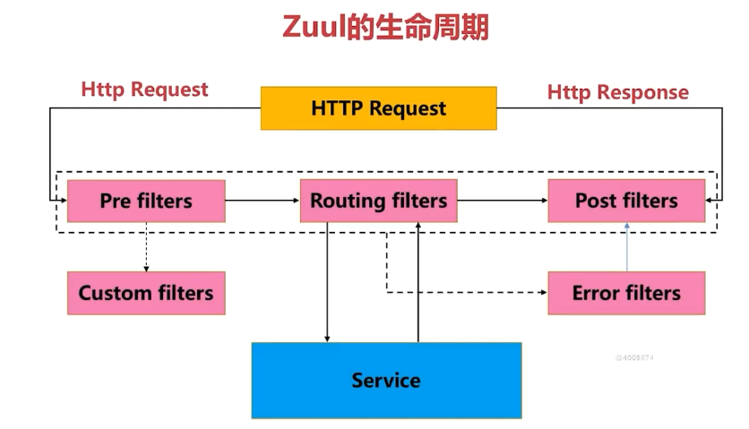
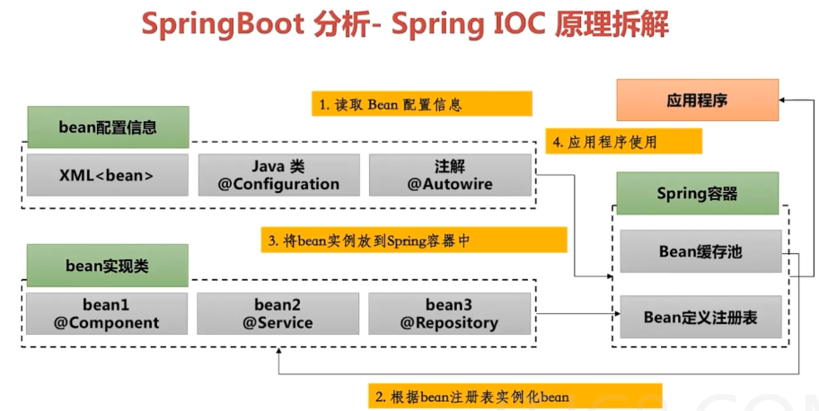
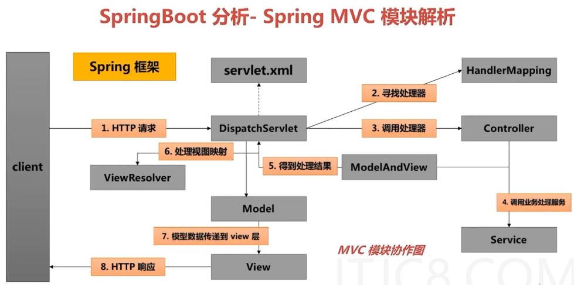
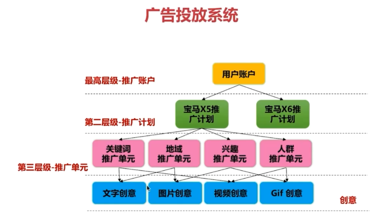
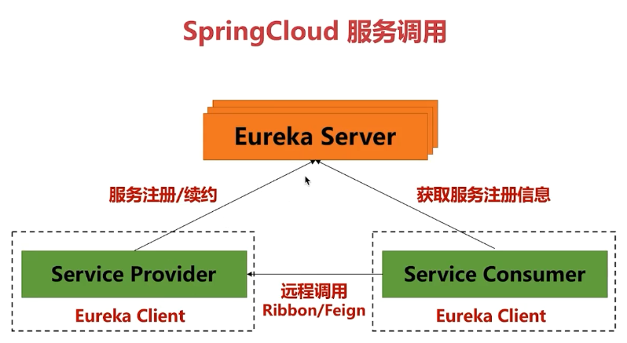
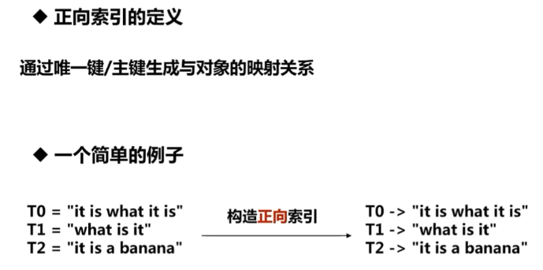
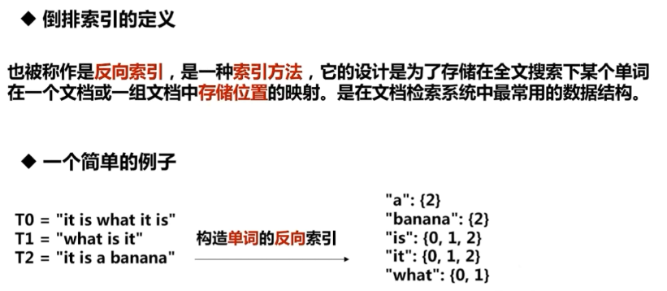
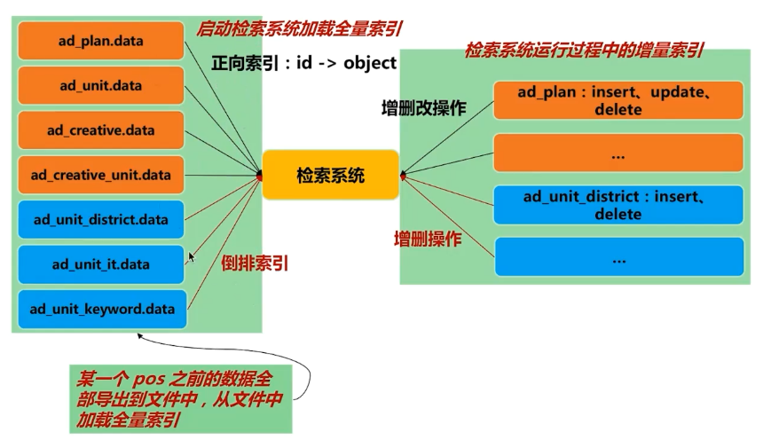

### 第1章 课程简介
#### 1-1 课程导学

主要介绍项目的基本开发环境


### 第2章 广告系统概览与准备工作
#### 2-1 广告系统概览

介绍广告主的投放 与媒体的投放


#### 2-2 广告系统架构

springcloud+mysql+kafka


#### 2-3 准备工作与系统目录结构

jdk1.8+idea+maven3+mysql5.5

主要包括如下的模块

==Eureka:实现服务注册与服务发现
gateway：利用Zuu|组件实现路由转发与请求信息记录(自定义过滤器)
广告系统服务实现子模块:
ad-common:通用代码，通用配置
ad-dashboard: Hystrix监控
ad-search:广告检索子系统
ad-sponsor:广告投放子系统。==


### 第3章 广告系统骨架开发
#### 3-1 Maven 基础知识

简单介绍maven相关的知识内容


#### 3-2 Maven 相关特性

依赖排除
短路优先
声明优先
多个模块聚合
父类统一管理dependencyManagement

#### 3-3 广告系统主工程

--------

新建一个空的module ad 并且整合如何的依赖

```xml-dtd
<?xml version="1.0" encoding="UTF-8"?>
<project xmlns="http://maven.apache.org/POM/4.0.0"
         xmlns:xsi="http://www.w3.org/2001/XMLSchema-instance"
         xsi:schemaLocation="http://maven.apache.org/POM/4.0.0 http://maven.apache.org/xsd/maven-4.0.0.xsd">
    <modelVersion>4.0.0</modelVersion>

    <groupId>com.ad</groupId>
    <artifactId>ad</artifactId>
    <version>1.0-SNAPSHOT</version>

    <packaging>pom</packaging>

    <name>ad</name>
    <description>parent empty module</description>
    <!--定义父类工程的版本-->
    <parent>
        <groupId>org.springframework.boot</groupId>
        <artifactId>spring-boot-starter-parent</artifactId>
        <version>2.0.2.RELEASE</version>
    </parent>

    <properties>
        <spring-cloud.version>Finchley.RELEASE</spring-cloud.version>
    </properties>
    <!--定义公共的依赖-->
    <dependencies>
        <dependency>
            <groupId>org.projectlombok</groupId>
            <artifactId>lombok</artifactId>
            <version>1.16.18</version>
        </dependency>
        <dependency>
            <groupId>org.springframework.boot</groupId>
            <artifactId>spring-boot-starter-test</artifactId>
            <scope>test</scope>
        </dependency>
    </dependencies>
    <!--定义子类的工程的依赖版本-->
    <dependencyManagement>
        <dependencies>
            <dependency>
                <groupId>org.springframework.cloud</groupId>
                <artifactId>spring-cloud-dependencies</artifactId>
                <version>${spring-cloud.version}</version>
                <type>pom</type>
                <scope>import</scope>
            </dependency>
        </dependencies>
    </dependencyManagement>
    <!--定义远程仓库-->
    <repositories>
        <repository>
            <id>spring-milestones</id>
            <name>Spring Milestones</name>
            <url>https://repo.spring.io/milestone</url>
            <snapshots>
                <enabled>false</enabled>
            </snapshots>
        </repository>
    </repositories>
</project>
```
#### 3-4 单节点 Eureka Server 的开发

```properties
#注册中心单节点的配置指南
#启动eurekaapplication.java

#浏览器访问 127.0.0.1:8000 查看注册情况


##设置应用名称
#spring.application.name=ad-eureka
##设置端口号
#server.port=8000
##设置访问地址
#eureka.instance.hostname=localhost
## 是否注册其他的组件 这里设置false单一的注册中心
#eureka.client.fetch-registry=false
## 是否把自己注册到注册中心 选择否 不注册自己
#eureka.client.register-with-eureka=false
##设置默认的访问地址
#eureka.client.service-url.defaultZone=http://${eureka.instance.hostname}:${server.port}/eureka/
#

```

```java
@EnableEurekaServer
@SpringBootApplication
public class EurekaApplication {
    public static void main(String[] args) {
        SpringApplication.run(EurekaApplication.class, args);
    }
}

```


#### 3-5 多节点Eureka Server 的部署配置

```properties
# 注册中心多节点配置
# 修改hosts文件 设置三个ip地址
#127.0.0.1 server1
#127.0.0.1 server2
#127.0.0.1 server3
# 项目打包如下所示 一个项目分别启动三次 实现多节点的注册集群
# 使用java -jar ad_eureka.jar -spring.active.profiles=server1
# 使用java -jar ad_eureka.jar -spring.active.profiles=server2
# 使用java -jar ad_eureka.jar -spring.active.profiles=server3

#访问127.0.0.1:8000 可以查看具体的注册情况

spring:
  application:
    name: ad-eureka
  profiles: server1
server:
  port: 8000
eureka:
  instance:
    hostname: server1
    prefer-ip-address: false
  client:
    service-url:
      defaultZone: http://server2:8001/eureka/,http://server3:8002/eureka/

---
spring:
  application:
    name: ad-eureka
  profiles: server2
server:
  port: 8001
eureka:
  instance:
    hostname: server2
    prefer-ip-address: false
  client:
    service-url:
      defaultZone: http://server1:8000/eureka/,http://server3:8002/eureka/

---
spring:
  application:
    name: ad-eureka
  profiles: server3
server:
  port: 8002
eureka:
  instance:
    hostname: server3
    prefer-ip-address: false
  client:
    service-url:
      defaultZone: http://server1:8000/eureka/,http://server2:8001/eureka/
```

```java
@EnableEurekaServer
@SpringBootApplication
public class EurekaApplication {
    public static void main(String[] args) {
        SpringApplication.run(EurekaApplication.class, args);
    }
}

```


#### 3-6 微服务架构及网关组件介绍





#### 3-7 网关启动程序的开发

```java
@EnableZuulProxy
@SpringCloudApplication
public class ZuulGatewayApplication {

    public static void main(String[] args) {
        SpringApplication.run(ZuulGatewayApplication.class,args);
    }
}
```

```properties
# 搭建服务网关的基本配置第一步
# 测试流程
# 1.启动注册中心
# 2.启动gateway
# 3.浏览器访问localhost:8000 查看Application
server.port=9000
spring.application.name=ad-gateway
eureka.client.service-url.defaultZone=http://localhost:8000/eureka/
```


#### 3-8 自定义网关过滤器的开发

```java
//自定义前置过滤器
@Slf4j
@Component
public class PreRequestFilter extends ZuulFilter {
    @Override
    public String filterType() {
        //设置前置拦截器
        return FilterConstants.PRE_TYPE;
    }

    @Override
    public int filterOrder() {
        return 0;
    }

    @Override
    public boolean shouldFilter() {
        //永远拦截 永远生效
        return true;
    }

    @Override
    public Object run() throws ZuulException {
        //设置请求时候的 访问时间
        RequestContext ctx = RequestContext.getCurrentContext();
        ctx.set("startTime",System.currentTimeMillis());
        return null;
    }
}
```

```java
//自定义后置拦截器 记录请求响应时间
@Slf4j
@Component
public class AccessLogFilter extends ZuulFilter {
    @Override
    public String filterType() {
        return FilterConstants.POST_TYPE;
    }

    @Override
    public int filterOrder() {
        //拦截顺序
        return FilterConstants.SEND_RESPONSE_FILTER_ORDER - 1;
    }

    @Override
    public boolean shouldFilter() {
        return true;
    }

    @Override
    public Object run() throws ZuulException {
        RequestContext context = RequestContext.getCurrentContext();
        HttpServletRequest request = context.getRequest();
        Long startTime = (Long) context.get("startTime");
        String uri = request.getRequestURI();
        Long duration = System.currentTimeMillis() - startTime;
        log.info("uri: " + uri + ", duration: " + duration / 100 + "ms");
        return null;
    }
}
```


### 第4章 微服务通用模块开发
#### 4-1 关于通用模块功能的介绍

定义一个service 模块聚合其他的模块

```xml-dtd
<?xml version="1.0" encoding="UTF-8"?>
<project xmlns="http://maven.apache.org/POM/4.0.0"
         xmlns:xsi="http://www.w3.org/2001/XMLSchema-instance"
         xsi:schemaLocation="http://maven.apache.org/POM/4.0.0 http://maven.apache.org/xsd/maven-4.0.0.xsd">
    <parent>
        <artifactId>ad</artifactId>
        <groupId>com.ad</groupId>
        <version>1.0-SNAPSHOT</version>
    </parent>
    <modelVersion>4.0.0</modelVersion>

    <artifactId>ad-service</artifactId>
    <version>1.0-SNAPSHOT</version>
    <!--设置为pom聚合其他的模块-->
    <packaging>pom</packaging>


</project>
```

在service下面定义一个common模块  添加统一的异常处理 统一响应处理 公共配置管理

```xml-dtd
<?xml version="1.0" encoding="UTF-8"?>
<project xmlns="http://maven.apache.org/POM/4.0.0"
         xmlns:xsi="http://www.w3.org/2001/XMLSchema-instance"
         xsi:schemaLocation="http://maven.apache.org/POM/4.0.0 http://maven.apache.org/xsd/maven-4.0.0.xsd">
    <!-- 指定父pom, 注意它是 ad-service 的子模块 -->
    <parent>
        <artifactId>ad-service</artifactId>
        <groupId>com.ad</groupId>
        <version>1.0-SNAPSHOT</version>
    </parent>
    <modelVersion>4.0.0</modelVersion>

    <!-- 当前项目/模块的坐标, groupId从父模块中继承 -->
    <artifactId>ad-common</artifactId>
    <version>1.0-SNAPSHOT</version>
    <packaging>jar</packaging>

    <dependencies>
        <!-- 引入 Web 功能 -->
        <dependency>
            <groupId>org.springframework.boot</groupId>
            <artifactId>spring-boot-starter-web</artifactId>
        </dependency>
        <!-- JSON 处理工具 -->
        <dependency>
            <groupId>com.alibaba</groupId>
            <artifactId>fastjson</artifactId>
            <version>1.2.31</version>
        </dependency>
    </dependencies>


</project>
```


#### 4-2 统一响应处理的开发

```java
//定义统一的响应体
@Data
@NoArgsConstructor
@AllArgsConstructor
public class CommonResponse<T> implements Serializable {

    private Integer code;
    private String message;
    private T data;

    public CommonResponse(Integer code, String message) {
        this.code = code;
        this.message = message;
    }
}
```

```java
//定义需要被忽视 不统一处理的注解
@Target({ElementType.TYPE, ElementType.METHOD})
@Retention(RetentionPolicy.RUNTIME)
public @interface IgnoreResponseAdvice {
}
```

```java
//对于所有的reponse响应都会添加统一的处理
//会设置统一的响应代码 响应消息
@RestControllerAdvice
public class CommonResponseDataAdvice implements ResponseBodyAdvice<Object> {

    @Override
    public boolean supports(MethodParameter methodParameter, Class<? extends HttpMessageConverter<?>> aClass) {
        //如果属性上 或者方法上 添加了IgnoreResponseAdvice 则直接返回 不回处理
        if (methodParameter.getDeclaringClass().isAnnotationPresent(IgnoreResponseAdvice.class)) {
            return false;
        }
        if (methodParameter.getMethod().getClass().isAnnotationPresent(IgnoreResponseAdvice.class)) {
            return false;
        }
        return true;
    }

    @Nullable
    @Override
    public Object beforeBodyWrite(@Nullable Object o, MethodParameter methodParameter, MediaType mediaType, Class<?
            extends
            HttpMessageConverter<?>> aClass, ServerHttpRequest serverHttpRequest, ServerHttpResponse serverHttpResponse) {
        CommonResponse<Object> response = new CommonResponse<>(0, "");
        if (null == o) {
            return response;
        } else if (o instanceof CommonResponse) {
            response = (CommonResponse) o;
        } else {
            response.setData(o);
        }
        return response;
    }
}
```


#### 4-3 统一异常处理的开发

```java
//定义统一的异常
public class AdException extends Exception {

    public AdException(String message) {
        super(message);
    }
}
```

```java
//定义统一的异常响应体
@RestControllerAdvice
public class GlobalExceptionAdvice {

    @ExceptionHandler(value = AdException.class)
    public CommonResponse<String> hadlerException(HttpServletRequest req,
                                                  AdException ex) {
        CommonResponse<String> response = new CommonResponse<>(-1, "business error");
        response.setData(ex.getMessage());
        return response;
    }
}
```


#### 4-4 统一配置的开发

```java
@Configuration
public class WebConfiguration implements WebMvcConfigurer {
    @Override
    public void configureMessageConverters(List<HttpMessageConverter<?>> converters) {
        //先情况转换器
        converters.clear();
        //设置统一的转换器 把返回的java对象统一转换为json格式
        converters.add(new MappingJackson2HttpMessageConverter());
    }
}
```


### 第5章 广告投放系统的开发
#### 5-1 Spring IOC和MVC基础知识





#### 5-2 SpringBoot 常用功能特性介绍

1.@springbootapplication注解的讲解

2.spring.active.profiles=active

3.@configurationproperties注解引入配置文件

4.springboot定时任务的说明

#### 5-3 广告投放系统数据表设计




#### 5-4 创建广告投放系统子模块

```xml-dtd
<?xml version="1.0" encoding="UTF-8"?>
<project xmlns="http://maven.apache.org/POM/4.0.0"
         xmlns:xsi="http://www.w3.org/2001/XMLSchema-instance"
         xsi:schemaLocation="http://maven.apache.org/POM/4.0.0 http://maven.apache.org/xsd/maven-4.0.0.xsd">
    <!-- 指定父pom, 注意它是 ad-service 的子模块 -->
    <parent>
        <artifactId>ad-service</artifactId>
        <groupId>com.ad</groupId>
        <version>1.0-SNAPSHOT</version>
    </parent>

    <modelVersion>4.0.0</modelVersion>

    <!-- 当前项目/模块的坐标, groupId从父模块中继承 -->
    <artifactId>ad-sponsor</artifactId>
    <version>1.0-SNAPSHOT</version>
    <packaging>jar</packaging>

    <dependencies>
        <!-- 引入 Web 功能 -->
        <dependency>
            <groupId>org.springframework.boot</groupId>
            <artifactId>spring-boot-starter-web</artifactId>
        </dependency>
        <!--
            Eureka 客户端, 客户端向 Eureka Server 注册的时候会提供一系列的元数据信息, 例如: 主机, 端口, 健康检查url等
            Eureka Server 接受每个客户端发送的心跳信息, 如果在某个配置的超时时间内未接收到心跳信息, 实例会被从注册列表中移除
        -->
        <dependency>
            <groupId>org.springframework.cloud</groupId>
            <artifactId>spring-cloud-starter-netflix-eureka-client</artifactId>
        </dependency>
        <!-- 引入 Feign, 可以以声明的方式调用微服务 -->
        <dependency>
            <groupId>org.springframework.cloud</groupId>
            <artifactId>spring-cloud-starter-openfeign</artifactId>
        </dependency>
        <!-- 引入服务容错 Hystrix 的依赖 -->
        <dependency>
            <groupId>org.springframework.cloud</groupId>
            <artifactId>spring-cloud-starter-netflix-hystrix</artifactId>
        </dependency>
        <!-- 引入服务消费者 Ribbon 的依赖 -->
        <dependency>
            <groupId>org.springframework.cloud</groupId>
            <artifactId>spring-cloud-starter-netflix-ribbon</artifactId>
        </dependency>
        <!-- Java Persistence API, ORM 规范 -->
        <dependency>
            <groupId>org.springframework.boot</groupId>
            <artifactId>spring-boot-starter-data-jpa</artifactId>
        </dependency>
        <!-- 数据库连接 -->
        <dependency>
            <groupId>org.springframework.boot</groupId>
            <artifactId>spring-boot-starter-jdbc</artifactId>
        </dependency>
        <!-- MySQL 驱动, 注意, 这个需要与 MySQL 版本对应 -->
        <dependency>
            <groupId>mysql</groupId>
            <artifactId>mysql-connector-java</artifactId>
            <version>5.1.44</version>
            <scope>runtime</scope>
        </dependency>
        <!-- 通用模块 -->
        <dependency>
            <groupId>com.ad</groupId>
            <artifactId>ad-common</artifactId>
            <version>1.0-SNAPSHOT</version>
        </dependency>
        <!-- apache 提供的一些工具类 -->
        <dependency>
            <groupId>commons-codec</groupId>
            <artifactId>commons-codec</artifactId>
            <version>1.9</version>
        </dependency>
    </dependencies>

    <!--
        SpringBoot的Maven插件, 能够以Maven的方式为应用提供SpringBoot的支持，可以将
        SpringBoot应用打包为可执行的jar或war文件, 然后以通常的方式运行SpringBoot应用
     -->
    <build>
        <plugins>
            <plugin>
                <groupId>org.springframework.boot</groupId>
                <artifactId>spring-boot-maven-plugin</artifactId>
            </plugin>
        </plugins>
    </build>

</project>
```

```properties
# 设置端口号
server.port=7000
#设置访问路径
server.servlet.context-path=/ad-sponsor
#应用名称
spring.application.name=eureka-client-ad-sponsor
# 查询显示SQL
spring.jpa.show-sql=true
#禁止ddl
spring.jpa.hibernate.ddl-auto=none
#//控制台是否打印
spring.jpa.properties.hibernate.format_sql=true
spring.jpa.open-in-view=false
spring.datasource.url=jdbc:mysql://127.0.0.1:3306/ad_data?autoReconnect=true
spring.datasource.username=root
spring.datasource.password=123456
spring.datasource.tomcat.max-active=4
spring.datasource.tomcat.min-idle=4
spring.datasource.tomcat.initial-size=4
#配置eureka client
eureka.client.service-url.defaultZone=http://localhost:8000/eureka/
```

```sql
-- ad 数据库
drop DATABASE ad_data;
CREATE DATABASE ad_data character set utf8;

use ad_data;

-- 用户表
CREATE TABLE `ad_user` (
  `id` bigint(20) NOT NULL AUTO_INCREMENT COMMENT '自增主键',
  `username` varchar(128) NOT NULL DEFAULT '' COMMENT '用户名',
  `token` varchar(256) NOT NULL DEFAULT '' COMMENT '给用户生成的 token',
  `user_status` tinyint(4) NOT NULL DEFAULT '0' COMMENT '用户状态',
  `create_time` datetime NOT NULL DEFAULT '1970-01-01 00:00:00' COMMENT '创建时间',
  `update_time` datetime NOT NULL DEFAULT '1970-01-01 00:00:00' COMMENT '更新时间',
  PRIMARY KEY (`id`),
  UNIQUE KEY `username` (`username`)
) ENGINE=InnoDB AUTO_INCREMENT=10 DEFAULT CHARSET=utf8 COMMENT='用户信息表';


-- 推广计划表
CREATE TABLE `ad_plan` (
  `id` bigint(20) NOT NULL AUTO_INCREMENT COMMENT '自增主键',
  `user_id` bigint(20) NOT NULL DEFAULT '0' COMMENT '标记当前记录所属用户',
  `plan_name` varchar(48) NOT NULL COMMENT '推广计划名称',
  `plan_status` tinyint(4) NOT NULL DEFAULT '0' COMMENT '推广计划状态',
  `start_date` datetime NOT NULL COMMENT '推广计划开始时间；',
  `end_date` datetime NOT NULL COMMENT '推广计划结束时间；',
  `create_time` datetime NOT NULL DEFAULT '1970-01-01 00:00:00' COMMENT '创建时间',
  `update_time` datetime NOT NULL DEFAULT '1970-01-01 00:00:00' COMMENT '更新时间',
  PRIMARY KEY (`id`)
) ENGINE=InnoDB AUTO_INCREMENT=10 DEFAULT CHARSET=utf8 COMMENT='推广计划表';


-- 推广单元表
CREATE TABLE `ad_unit` (
  `id` bigint(20) NOT NULL AUTO_INCREMENT COMMENT '自增主键',
  `plan_id` bigint(20) NOT NULL DEFAULT '0' COMMENT '关联推广计划 id',
  `unit_name` varchar(48) NOT NULL COMMENT '推广单元名称',
  `unit_status` tinyint(4) NOT NULL DEFAULT '0' COMMENT '推广单元状态',
  `position_type` tinyint(4) NOT NULL DEFAULT '0' COMMENT '广告位类型(开屏, 贴片, 中贴, 暂停帖, 后贴)',
  `budget` bigint(20) NOT NULL COMMENT '预算',
  `create_time` datetime NOT NULL DEFAULT '1970-01-01 00:00:00' COMMENT '创建时间',
  `update_time` datetime NOT NULL DEFAULT '1970-01-01 00:00:00' COMMENT '更新时间',
  PRIMARY KEY (`id`)
) ENGINE=InnoDB AUTO_INCREMENT=10 DEFAULT CHARSET=utf8 COMMENT='推广单元表';


-- 创意表
CREATE TABLE `ad_creative` (
  `id` bigint(20) NOT NULL AUTO_INCREMENT COMMENT '自增主键',
  `name` varchar(48) NOT NULL COMMENT '创意名称',
  `type` tinyint(4) NOT NULL DEFAULT '0' COMMENT '物料类型(图片, 视频)',
  `material_type` tinyint(4) NOT NULL DEFAULT '0' COMMENT '物料子类型(图片: bmp, jpg 等等)',
  `height` int(10) NOT NULL DEFAULT '0' COMMENT '高度',
  `width` int(10) NOT NULL DEFAULT '0' COMMENT '宽度',
  `size` bigint(20) NOT NULL DEFAULT '0' COMMENT '物料大小, 单位是 KB',
  `duration` int(10) NOT NULL DEFAULT '0' COMMENT '持续时长, 只有视频才不为 0',
  `audit_status` tinyint(4) NOT NULL DEFAULT '0' COMMENT '审核状态',
  `user_id` bigint(20) NOT NULL DEFAULT '0' COMMENT '标记当前记录所属用户',
  `url` varchar(256) NOT NULL COMMENT '物料地址',
  `create_time` datetime NOT NULL DEFAULT '1970-01-01 00:00:00' COMMENT '创建时间',
  `update_time` datetime NOT NULL DEFAULT '1970-01-01 00:00:00' COMMENT '更新时间',
  PRIMARY KEY (`id`)
) ENGINE=InnoDB AUTO_INCREMENT=10 DEFAULT CHARSET=utf8 COMMENT='创意表';


-- 创意与推广单元的关联表
CREATE TABLE `creative_unit` (
  `id` bigint(20) NOT NULL AUTO_INCREMENT,
  `creative_id` bigint(20) NOT NULL DEFAULT '0' COMMENT '创意 id',
  `unit_id` bigint(20) NOT NULL DEFAULT '0' COMMENT '推广单元 id',
  PRIMARY KEY (`id`)
) ENGINE=InnoDB AUTO_INCREMENT=10 DEFAULT CHARSET=utf8 COMMENT='创意和推广单元关联表';


-- 推广单元关键词 Feature
CREATE TABLE `ad_unit_keyword` (
  `id` int(11) NOT NULL AUTO_INCREMENT,
  `unit_id` int(11) NOT NULL COMMENT '推广单元 id',
  `keyword` varchar(30) NOT NULL COMMENT '关键词',
  PRIMARY KEY (`id`)
) ENGINE=InnoDB AUTO_INCREMENT=10 DEFAULT CHARSET=utf8 COMMENT='推广单元关键词 Feature';


-- 推广单元兴趣 Feature
CREATE TABLE `ad_unit_it` (
  `id` int(11) NOT NULL AUTO_INCREMENT,
  `unit_id` int(11) NOT NULL COMMENT '推广单元 id',
  `it_tag` varchar(30) NOT NULL COMMENT '兴趣标签',
  PRIMARY KEY (`id`)
) ENGINE=InnoDB AUTO_INCREMENT=10 DEFAULT CHARSET=utf8 COMMENT='推广单元兴趣 Feature';


-- 推广单元地域 Feature
CREATE TABLE `ad_unit_district` (
  `id` int(11) NOT NULL AUTO_INCREMENT,
  `unit_id` int(11) NOT NULL COMMENT '推广单元 id',
  `province` varchar(30) NOT NULL COMMENT '省',
  `city` varchar(30) NOT NULL COMMENT '市',
  PRIMARY KEY (`id`)
) ENGINE=InnoDB AUTO_INCREMENT=10 DEFAULT CHARSET=utf8 COMMENT='推广单元地域 Feature';

```

```java
//启动SponsorApplication 
//浏览器访问localhost:8000 可以看到服务注册的具体情况
@EnableFeignClients
@EnableCircuitBreaker
@EnableEurekaClient
@SpringBootApplication
public class SponsorApplication {

    public static void main(String[] args) {

        SpringApplication.run(SponsorApplication.class, args);
    }
}
```


#### 5-5 数据表实体类定义（1）

entity.AdUser.java
constant.CommonStatus.java


#### 5-6 数据表实体类定义（2）

entity.AdPlan.java
entity.AdUnit.java


#### 5-7 数据表实体类定义（3）

unit_condition.AdUnitKeyword.java
unit_condition.AdUnitIt.java
unit_condition.AdUnitDistrict.java


#### 5-8 数据表实体类定义（4）

entity.Creative.java
unit_condition.CreativeUnit.java
constant.CreativeType.java
constant.CreativeMetrialType.java


#### 5-9 数据表Dao接口的定义（1）

dao.AdPlanRepository.java
dao.AdUnitRepository.java
dao.AdUserRepository.java
dao.CreativeRepository.java


#### 5-10 数据表Dao接口的定义（2）

unit_condition.AdUnitKeywordRepository.java
unit_condition.AdUnitItRepository.java
unit_condition.AdUnitDistrictRepository.java
unit_condition.CreativeUnitRepository.java


#### 5-11 用户账户服务功能实现

service.IUserService.java
vo.CreateUserRequest.java
vo.CreateUserResponse.java
impl.UserServiceImpl.java
constant.Constants.java
utils.CommonUtils.java


#### 5-12 推广计划服务功能实现（1）

service.IAdPlanService.java
vo.AdPlanRequest.java
vo.AdPlanResponse.java
vo.AdPlanGetRequest.java


#### 5-13 推广计划服务功能实现（2）

impl.AdPlanServiceImpl.java


#### 5-14 推广单元服务功能实现

service.IAdUnitService.java
vo.AdUnitItRequest.java
vo.AdUnitItResponse.java
impl.AdUnitServiceImpl.java


#### 5-15 推广单元限制服务功能实现（1）

vo.AdUnitKeywordRequest.java
vo.AdUnitKeywordResponse.java
vo.AdUnitRequest.java
vo.AdUnitResponse.java
vo.AdUnitDistrictRequest.java
vo.AdUnitDistrictResponse.java


#### 5-16 推广单元限制服务功能实现（2）

impl.AdUnitServiceImpl.java修改实现


#### 5-17 创意服务功能实现

impl.CreativeServiceImpl.java
vo.CreativeRequest.java
vo.CreativeResponse.java
service.ICreativeService.java


#### 5-18 创意与推广单元关联服务功能实现

vo.CreativeUnitRequest.java
vo.CreativeUnitResponse.java
impl.AdUnitServiceImpl.java修改


#### 5-19 服务Controller的编写（1）

controller.UserOPController.java
controller.AdPlanOPController.java

#### 5-20 服务Controller的编写（2）

controller.AdUnitOPController.java
controller.CreativeOPController.java


#### 5-21 投放系统在网关中的配置

```properties
#搭建服务网关的基本配置第二步 配置服务的请求前缀 路由 转发
zuul.prefix=/imooc
#定义sponsor路由设置路由路径 id
zuul.routes.sponsor.path=/ad-sponsor/**
zuul.routes.sponsor.serviceId=eureka-client-ad-sponsor
#stripPrefix=false 时 转发时不会移除前缀
zuul.routes.sponsor.strip-prefix=false
#定义search路由设置路由路径 id
zuul.routes.search.path=/ad-search/**
zuul.routes.search.serviceId=eureka-client-ad-search
#stripPrefix=false 时 转发时不会移除前缀
zuul.routes.search.strip-prefix=false
```


#### 5-22 数据库与数据表的创建

执行ad-sponsor.sql建表操作


### 第6章 广告检索系统 - 微服务调用
#### 6-1 创建广告检索系统子模块



```xml
<?xml version="1.0" encoding="UTF-8"?>
<project xmlns="http://maven.apache.org/POM/4.0.0"
         xmlns:xsi="http://www.w3.org/2001/XMLSchema-instance"
         xsi:schemaLocation="http://maven.apache.org/POM/4.0.0 http://maven.apache.org/xsd/maven-4.0.0.xsd">
    <!-- 指定父pom, 注意它是 ad-service 的子模块 -->
    <parent>
        <artifactId>ad-service</artifactId>
        <groupId>com.ad</groupId>
        <version>1.0-SNAPSHOT</version>
    </parent>

    <modelVersion>4.0.0</modelVersion>

    <!-- 当前项目/模块的坐标, groupId从父模块中继承 -->
    <artifactId>ad-search</artifactId>
    <version>1.0-SNAPSHOT</version>
    <packaging>jar</packaging>

    <dependencies>
        <!-- Hystrix 监控 -->
        <dependency>
            <groupId>org.springframework.cloud</groupId>
            <artifactId>spring-cloud-starter-netflix-hystrix-dashboard</artifactId>
        </dependency>
        <!-- 监控端点, 采集应用指标 -->
        <dependency>
            <groupId>org.springframework.boot</groupId>
            <artifactId>spring-boot-starter-actuator</artifactId>
        </dependency>
        <!-- 引入 Web 功能 -->
        <dependency>
            <groupId>org.springframework.boot</groupId>
            <artifactId>spring-boot-starter-web</artifactId>
        </dependency>
        <!--
            Eureka 客户端, 客户端向 Eureka Server 注册的时候会提供一系列的元数据信息, 例如: 主机, 端口, 健康检查url等
            Eureka Server 接受每个客户端发送的心跳信息, 如果在某个配置的超时时间内未接收到心跳信息, 实例会被从注册列表中移除
        -->
        <dependency>
            <groupId>org.springframework.cloud</groupId>
            <artifactId>spring-cloud-starter-netflix-eureka-client</artifactId>
        </dependency>
        <!-- 引入 Feign, 可以以声明的方式调用微服务 -->
        <dependency>
            <groupId>org.springframework.cloud</groupId>
            <artifactId>spring-cloud-starter-openfeign</artifactId>
        </dependency>
        <!-- 引入服务容错 Hystrix 的依赖 -->
        <dependency>
            <groupId>org.springframework.cloud</groupId>
            <artifactId>spring-cloud-starter-netflix-hystrix</artifactId>
        </dependency>
        <!-- 引入服务消费者 Ribbon 的依赖 -->
        <dependency>
            <groupId>org.springframework.cloud</groupId>
            <artifactId>spring-cloud-starter-netflix-ribbon</artifactId>
        </dependency>
        <!-- Java Persistence API, ORM 规范 -->
        <dependency>
            <groupId>org.springframework.boot</groupId>
            <artifactId>spring-boot-starter-data-jpa</artifactId>
        </dependency>
        <!-- 数据库连接 -->
        <dependency>
            <groupId>org.springframework.boot</groupId>
            <artifactId>spring-boot-starter-jdbc</artifactId>
        </dependency>
        <!-- MySQL 驱动, 注意, 这个需要与 MySQL 版本对应 -->
        <dependency>
            <groupId>mysql</groupId>
            <artifactId>mysql-connector-java</artifactId>
            <version>8.0.12</version>
            <scope>runtime</scope>
        </dependency>
        <!-- 通用模块 -->
        <dependency>
            <groupId>com.ad</groupId>
            <artifactId>ad-common</artifactId>
            <version>1.0-SNAPSHOT</version>
        </dependency>
        <!-- apache 提供的一些工具类 -->
        <dependency>
            <groupId>commons-codec</groupId>
            <artifactId>commons-codec</artifactId>
            <version>1.9</version>
        </dependency>
        <!-- 集合类操作 -->
        <dependency>
            <groupId>org.apache.commons</groupId>
            <artifactId>commons-collections4</artifactId>
            <version>4.0</version>
        </dependency>
        <!-- binlog 监听与解析: https://github.com/shyiko/mysql-binlog-connector-java -->
        <dependency>
            <groupId>com.github.shyiko</groupId>
            <artifactId>mysql-binlog-connector-java</artifactId>
            <version>0.13.0</version>
        </dependency>
        <!-- 解析配置文件中的配置 -->
        <dependency>
            <groupId>org.springframework.boot</groupId>
            <artifactId>spring-boot-configuration-processor</artifactId>
        </dependency>
        <!--kafka 依赖-->
        <dependency>
            <groupId>org.springframework.kafka</groupId>
            <artifactId>spring-kafka</artifactId>
            <version>2.1.5.RELEASE</version>
        </dependency>
    </dependencies>

    <!--
        SpringBoot的Maven插件, 能够以Maven的方式为应用提供SpringBoot的支持，可以将
        SpringBoot应用打包为可执行的jar或war文件, 然后以通常的方式运行SpringBoot应用
     -->
    <build>
        <plugins>
            <plugin>
                <groupId>org.springframework.boot</groupId>
                <artifactId>spring-boot-maven-plugin</artifactId>
            </plugin>
        </plugins>
    </build>


</project>
```

```properties
# 设置端口号
server.port=7001
#设置访问路径
server.servlet.context-path=/ad-search
#应用名称
spring.application.name=eureka-client-ad-search
# 查询显示SQL
spring.jpa.show-sql=true
#禁止ddl
spring.jpa.hibernate.ddl-auto=none
#//控制台是否打印
spring.jpa.properties.hibernate.format_sql=true
spring.jpa.open-in-view=false
spring.datasource.url=jdbc:mysql://127.0.0.1:3306/ad_data?autoReconnect=true
spring.datasource.username=root
spring.datasource.password=123456
spring.datasource.tomcat.max-active=4
spring.datasource.tomcat.min-idle=4
spring.datasource.tomcat.initial-size=4
#配置eureka client
eureka.client.service-url.defaultZone=http://localhost:8000/eureka/
```

```java
@EnableFeignClients
@EnableEurekaClient
@EnableHystrix
@EnableCircuitBreaker
@EnableDiscoveryClient
@EnableHystrixDashboard
@SpringBootApplication
public class SearchApplication {
    public static void main(String[] args) {
        SpringApplication.run(SearchApplication.class, args);
    }
}
```


#### 6-2 基于 Ribbon 实现微服务调用

```java
	//1.resttemplate注册
	//开启负载均衡
    @Bean
    @LoadBalanced
    RestTemplate restTemplate() {
        return new RestTemplate();
    }
```

2.新增响应类 AdPlan  AdPlanGetRequest

```java
//3.定义一个searchController
@Slf4j
@RestController
public class SearchController {
    private final RestTemplate restTemplate;

    @Autowired
    public SearchController(RestTemplate restTemplate) {
        this.restTemplate = restTemplate;
    }

    @IgnoreResponseAdvice
    @PostMapping("/getAdPlansByRibbon")
    public CommonResponse<List<AdPlan>> getAdPlansByRibbon(@RequestBody AdPlanGetRequest request) {
        log.info("ad-search: getAdPlansByRibbon -> {}",
                JSON.toJSONString(request));
        return restTemplate.postForEntity(
                "http://eureka-client-ad-sponsor/ad-sponsor/get/adPlan",
                request,
                CommonResponse.class
        ).getBody();
    }
}
```


#### 6-3 基于 Feign 实现微服务调用

```java
//添加一个声明式接口
//添加断路回调函数
@FeignClient(value = "eureka-client-ad-sponsor",
        fallback = SponsorClientHystrix.class)
public interface SponsorClient {
    
    @RequestMapping(value = "/ad-sponsor/get/adPlan",
            method = RequestMethod.POST)
    CommonResponse<List<AdPlan>> getAdPlans(
            @RequestBody AdPlanGetRequest request);
}
```

```java
	//具体的searchcontroller发出请求    
	@IgnoreResponseAdvice
    @PostMapping("/getAdPlans")
    public CommonResponse<List<AdPlan>> getAdPlans(@RequestBody AdPlanGetRequest request) {
        log.info("ad-search: getAdPlans -> {}",
                JSON.toJSONString(request));
        return sponsorClient.getAdPlans(request);
    }
```

```java
//添加异常回调函数
@Component
public class SponsorClientHystrix implements SponsorClient {

    @Override
    public CommonResponse<List<AdPlan>> getAdPlans(
            AdPlanGetRequest request) {
        return new CommonResponse<>(-1,
                "eureka-client-ad-sponsor error");
    }
}
```


### 第7章 广告检索系统 - 广告数据索引的设计与实现
#### 7-1 广告数据索引设计介绍





#### 7-2 广告数据索引维护介绍




#### 7-3 推广计划索引对象定义与服务实现

IndexAware
AdPlanObject
AdPlanIndex


#### 7-4 推广单元索引对象定义与服务实现

AdUnitObject
AdUnitIndex


#### 7-5 关键词索引对象定义与服务实现


#### 7-6 兴趣索引对象定义与服务实现


#### 7-7 地域索引对象定义与服务实现


#### 7-8 创意索引对象定义与服务实现


#### 7-9 创意与推广单元关联索引对象定义与服务实现


#### 7-10 索引服务类缓存的实现


### 第8章 广告检索系统 - 加载全量索引
#### 8-1 导出表数据字段定义（1）(1)


#### 8-10 全量索引加载的实现（1）


#### 8-11 全量索引加载的实现（2）


#### 8-2 导出表数据字段定义（2）


#### 8-3 表数据导出到文件功能实现（1）


#### 8-4 表数据导出到文件功能实现（2）


#### 8-5 表数据导出到文件功能实现（3）


#### 8-6 索引操作Handler的定义与说明


#### 8-7 第二层级索引操作的实现


#### 8-8 第三层级索引操作的实现


#### 8-9 第四层级索引操作的实现


### 第9章 广告检索系统-监听Binlog构造增量数据
#### 9-1 MySQL Binlog 的介绍


#### 9-10 根据 Binlog 对象构造增量数据的实现


#### 9-11 启动对 Binlog 的监听


#### 9-2 使用开源工具监听 Binlog 的演示


#### 9-3 构造解析 Binlog 使用到的模板文件


#### 9-4 实现对模板对象的解析


#### 9-5 载入模板文件并实现列索引到列名的映射


#### 9-6 关于 Binlog 监听与解析的说明


#### 9-7 Binlog 监听与解析的实现（1）


#### 9-8 Binlog 监听与解析的实现（2）


#### 9-9 根据 Binlog 对象构造增量数据的准备工作


### 第10章 广告检索系统 - Binlog增量数据的投递

#### 10-1 增量数据投递前的准备工作


#### 10-2 第二层级增量数据的投递


#### 10-3 第三层级增量数据的投递


#### 10-4 第四层级增量数据的投递


#### 10-5 将增量数据投递到Kafka


### 第11章 广告检索系统-广告检索服务

#### 11-1 广告检索服务功能的介绍


#### 11-2 媒体方请求对象的定义


#### 11-3 检索服务响应对象的定义


#### 11-4 根据流量类型实现对推广单元的预筛选


#### 11-5 根据匹配信息实现对推广单元的再筛选


#### 11-6 通过推广单元获取关联的创意实现


#### 11-7 填充检索服务响应对象


#### 11-8 完善广告检索服务


### 第12章 Kafka的安装与使用

#### 12-1 Kafka 基础知识的介绍


#### 12-2 Kafka 的安装与使用


#### 12-3 使用原生API发送消息（1）


#### 12-4 使用原生API发送消息（2）


#### 12-5 自定义分区分配器


#### 12-6 消费者与消费者组的概念


#### 12-7 使用原生API消费消息（1）


#### 12-8 使用原生API消费消息（2）


#### 12-9 使用原生API消费消息（3）


### 第13章 熔断监控Hystrix Dashboard

#### 13-1 Hystrix Dashboard 的介绍


#### 13-2 Dashboard 模块的实现


### 第14章 广告系统的可用性测试

#### 14-1 广告系统测试前的准备工作


#### 14-2 编写广告投放系统的测试用例


#### 14-3 编写广告检索系统的测试用例（上）


#### 14-4 编写广告检索系统的测试用例（下）


#### 14-5 投放系统的 HTTP 接口测试


### 第15章 课程总结

#### 15-1 课程总结