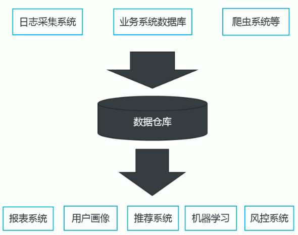
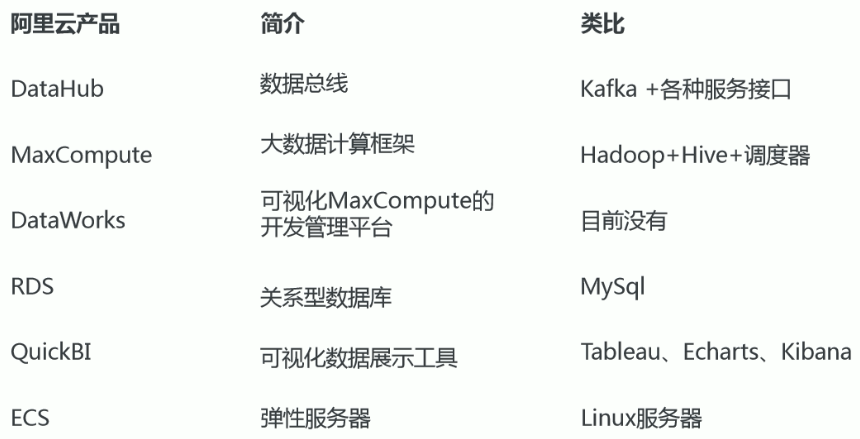
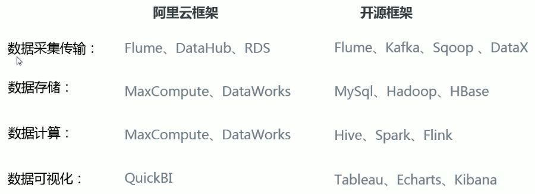
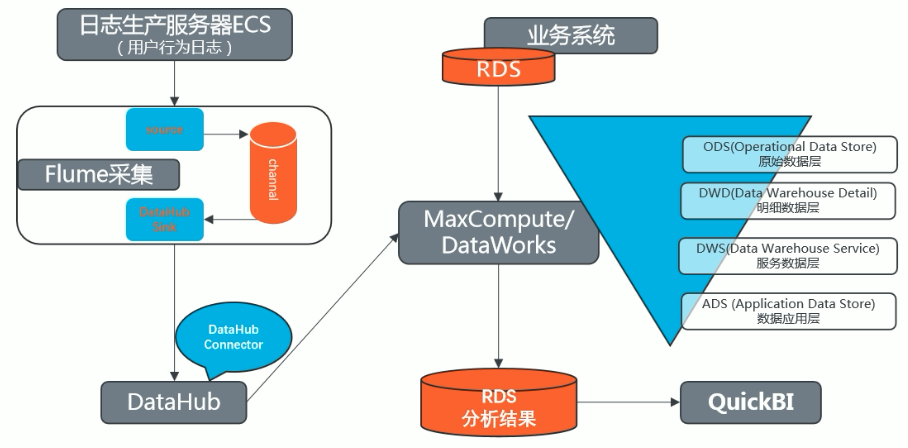
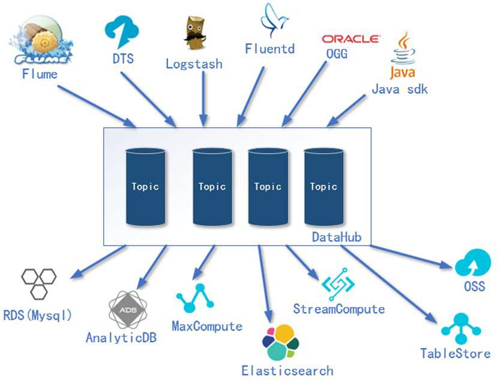
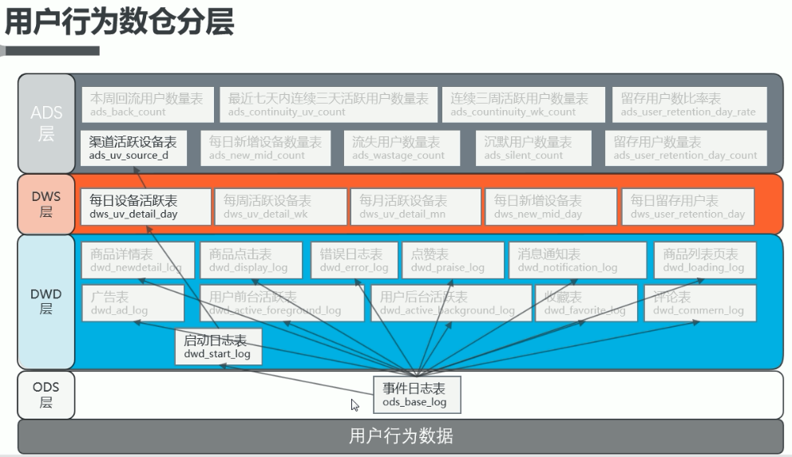
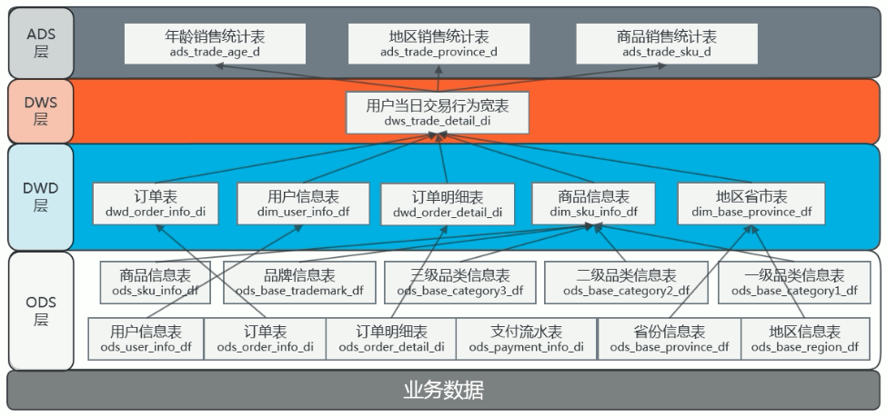

### 01_阿里云大学_项目课程简介

1）学习搭建一个数据仓库的过程，理解数据在整个数仓架构的从采集、存储、计算、输出、展示的整个业务流程。

#### 02_阿里云大学_数据仓库概念

#### 03_项目需求及架构设计_项目需求分析

1）采集埋点日志数据
2）采集业务数据库中数据
3）数据仓库的搭建（用户行为数仓、业务数仓）
4）分析统计业务指标
5）对结果进行可视化展示

#### 04_项目需求及架构设计_阿里云计算框架

#### 05_项目需求及架构设计_项目技术选型

#### 06_项目需求及架构设计_系统数据流程设计

#### 07_项目需求及架构设计_服务器选型

#### 08_项目需求及架构设计_集群规模及购买服务器建议

#### 09_数据生成模块_埋点数据基本格式

3.1 埋点数据基本格式
1）公共字段：基本所有安卓手机都包含的字段
2）业务字段：埋点上报的字段，有具体的业务类型
下面就是一个示例，表示业务字段的上传。
{
"ap":"xxxxx",//项目数据来源 app pc

"cm": { // 公共字段 },

"et": [ // 事件]

}

#### 10_数据生成模块_事件日志数据

3.2.1 商品列表页（ 商品列表页（ loading）

3.2.2 商品曝光（ 商品曝光（ display）

3.2.3 商品详情页（ 商品详情页（ newsdetail）

3.2.4 购物车（ cart）

3.2.5 广告（ ad）

3.2.6 消息通知（ 消息通知（ notification）

3.2.7 评论（ comment）

3.2.8 收藏（ favorites）

3.2.9 点赞（ praise）

3.2.10 错误日志（ 错误日志（ error）

3.2.11 启动日志数据（ 启动日志数据（ start）

#### 11_数据生成模块_数据生成脚本

生成log日志

#### 12_数据采集模块_注册购买ECS云服务器

#### 13_数据采集模块_配置防火墙

#### 14_数据采集模块_ECS配置升级

#### 15_数据采集模块_阿里云服务器连接

#### 16_数据采集模块_配置主机名称映射

vi /etc/sysconfig/network

NETWORKING=yes 

HOSTNAME= hadoop102

vim /etc/hosts

172.26.74.102 hadoop104 hadoop104
172.26.74.103 hadoop102 hadoop102
172.26.74.104 hadoop103 hadoop103

#### 17_数据采集模块_创建普通用户atguigu

useradd atguigu

password atguigu

#### 18_数据采集模块_集群分发脚本xsync

#### 19_数据采集模块_配置SSH无密登录

ssh-keygen -t rsa

#### 20_数据采集模块_集群整体操作脚本

#### 21_数据采集模块_JDK安装

#### 22_数据采集模块_日志生成

#### 23_数据采集模块_Flume安装及使用 1.7.0

1）Source主要负责采集工作
2）Channel扮演数据管道的角色，对进行缓冲。
3）Sink把 Channel中的数据输出到外部环境，支持多种接口

#### 24_数据采集模块_DataHub简介

#### 25_数据采集模块_创建DataHub与Topic

kafka创建消费主题

#### 26_数据采集模块_Flume推送数据到DataHub

#### 27_数据采集模块_DataWorks和MaxCompute简介

#### 28_数据采集模块_创建工作空间

#### 29_用户行为数仓搭建_数仓分层概念

1）ODS层
原始数据层，存放直接加载日志、保持貌不做处理。
2）DWD层
对 ODS层数据进行清洗（去除空值，脏超过极限范围的）
3）DWS层
以 DWD为基础，进行轻度汇总。 为基础，进行轻度汇总。
4）ADS层
为各种统计报表提供数据 为各种统计报表提供数据 

ODS层命名为ods前缀
DWD层命名为dwd前缀

DWS层命名为dws前缀
ADS层命名为ads前缀
维度表命名为dim前缀
每日全量导入命名为df（day full）后缀
每日增量导入命名为di（day increase）后缀

#### 30_用户行为数仓搭建_数仓分层配置

#### 31_用户行为数仓搭建_原始数据层（ODS层）

#### 32_用户行为数仓搭建_DataHub推送数据到MaxCompute

#### 33_用户行为数仓搭建_dwd层日志格式分析

#### 34_用户行为数仓搭建_自定义UDTF

自定义UDTF函数 一对多表的处理

#### 35_用户行为数仓搭建_DWD层建表（启动日志表）

#### 36_用户行为数仓搭建_手动将ODS层数据导入DWD层

#### 37_用户行为数仓搭建_DWD层数据导入脚本

#### 38_用户行为数仓搭建_手动将DWD层数据导入DWS层

#### 39_用户行为数仓搭建_DWS层数据导入脚本

#### 40_用户行为数仓搭建_ADS层脚本及日活需求：全流程业务调度

#### 41_业务数仓理论_表的分类

6.1.1实体表
实体表，一般是指一个现实存在的业务对象，比如用户，商品，商家，销售员等等。

6.1.2维度表
维度表，一般是指对应一些业务状态，编号的解释表。也可以称之为码表。
比如地区表，订单状态，支付方式，审批状态，商品分类等等。

6.1.3事务型事实表
事务型事实表，一般指随着业务发生不断产生的数据。特点是一旦发生不会再变化。一般比如，交易流水，操作日志，出库入库记录等等。

6.1.4周期型事实表
周期型事实表，一般指随着业务发生不断产生的数据。
与事务型不同的是，数据会随着业务周期性的推进而变化。
比如订单，其中订单状态会周期性变化。再比如，请假、贷款申请，随着批复状态在周期性变化。

#### 42_业务数仓理论_表的同步策略

数据同步策略的类型包括：全量表、增量表、新增及变化表
>全量表：存储完整的数据。
>增量表：存储新增加的数据。
>新增及变化表：存储新增加的数据和变化的数据。

6.2.1实体表同步策略
**实体表**：比如用户，商品，商家，销售员等实体表数据量比较小：通常可以做每日全量，就是每天存一份完整数据。即**每日全量**。
6.2.2维度表同步策略
**维度表**：比如订单状态，审批状态，商品分类维度表数据量比较小：通常可以做每日全量，就是每天存一份完整数据。即**每日全量**。
说明：
1）针对可能会有变化的状态数据可以存储每日全量。
2）没变化的客观世界的维度（比如性别，地区，民族，政治成分，鞋子尺码）可以只存一份固定值。
6.2.3事务型事实表同步策略
**事务型事实表**：比如，交易流水，操作日志，出库入库记录等。
因为数据不会变化，而且数据量巨大，所以每天只同步新增数据即可，所以可以做成每日增量表，即**每日创建一个分区存储**。
6.2.4周期型事实表同步策略
**周期型事实表**：比如，订单、请假、贷款申请等这类表从数据量的角度，**存每日全量的话**，数据量太大，冗余也太大。如果用每日增量的话无法反应数据变化。

#### 43_业务数仓搭建_业务数仓架构图

#### 44_业务数仓搭建_RDS服务器准备

#### 45_业务数仓搭建_创建业务数据库及表

#### 46_业务数仓搭建_ODS层数据表创建

#### 47_业务数仓搭建_建立数据同步节点

#### 48_业务数仓搭建_每日全量表同步

#### 49_业务数仓搭建_每日增量表同步

#### 50_业务数仓搭建_每日新增及变化表同步

今天创建或者今天操作

#### 51_业务数仓搭建_ODS层调度[IT教程吧]

#### 52_业务数仓搭建_DWD层建表语句

#### 53_业务数仓搭建_手动将数据导入DWD层

#### 54_业务数仓搭建_DWD层数据导入脚本

#### 55_业务数仓搭建_DWS层建表及脚本编写

#### 56_业务数仓搭建_ADS层建表及手动导入数据

#### 57_业务数仓搭建_作业调度

#### 58_业务数仓搭建_作业调度执行

#### 59_数据导出与作业调度_创建商品销售数据同步节点

#### 60_数据导出与作业调度_创建同步节点及作业调度[IT教程吧]

#### 61_数据导出与作业调度_业务数仓全流程作业调度

#### 62_数据可视化_DataV简介

#### 63_数据可视化_购买QuickBI

#### 64_数据可视化_各个渠道日活占比图_配置数据源

#### 65_数据可视化_各个渠道日活占比图_配置数据集

#### 66_数据可视化_各个渠道日活占比图_配置饼图仪表盘

#### 67_数据可视化_地区销售额分析

#### 68_数据可视化_年龄段销售额占比分析

#### 69_数据可视化_热门商品分析[IT教程吧]

#### 70_数据可视化_分享仪表盘

#### 71_数据可视化_数据门户（高级版）简介

#### 72_协同工作_RAM管理界面

#### 73_协同工作_RAM账号如何登录

#### 74_阿里云大学_项目总结

