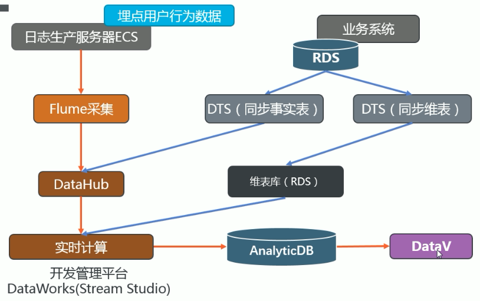
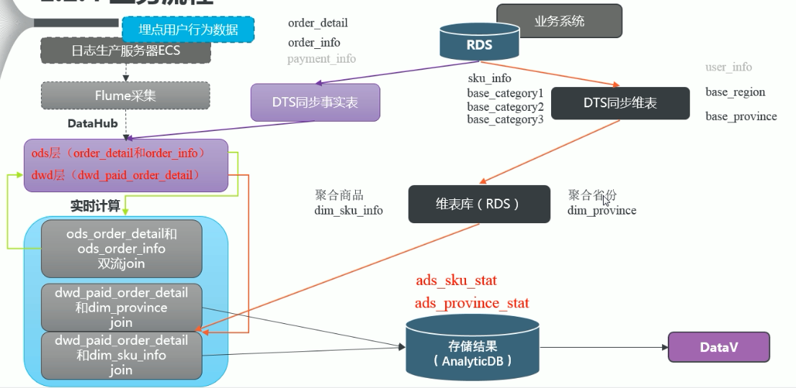

#### 01项目简介

1）学习搭建一个实时数据仓库，掌握数据采集、存储、计算、输出、展示等整个业务流程。

#### 02项目需求分析

1）实时采集埋点日志数据
2）实时采集业务数据库中数据
3）对数据进行清洗和处理
4）保存数据到分析型数据库
5）对结果进行可视化展示

#### 03阿里云技术框架

#### 04技术选型

#### 05系统架构设计

#### 06业务流程

#### 07电商表结构

#### 08RDS购买

#### 09RDS配置及连接

#### 10创建业务数据库及表

#### 11创建DataHub及Project

#### 12同步事实表到DataHub

#### 13同步维表到MySQL

#### 14实时数仓分层

#### 15创建集群和创建项目

#### 16创建工作空间及业务开发平台

#### 17建立任务及flinkSQL开发手册

#### 18ODS到DWD层的业务流程

#### 19AnalyticDB购买

#### 20RDS和AnalyticDB白名单配置及创建结果表

#### 21DWD到ADS层的业务流程（地区销售分布统计）

#### 22DWD到ADS层的业务流程（商品统计）

#### 23DataV简介

#### 24DataV购买及白名单授权

#### 25地区分布统计可视化

#### 26商品统计可视化

#### 27项目总结

